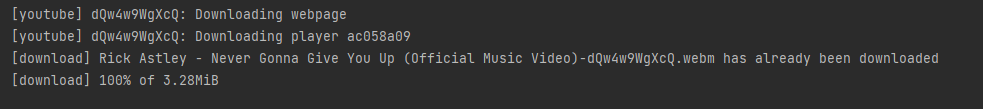
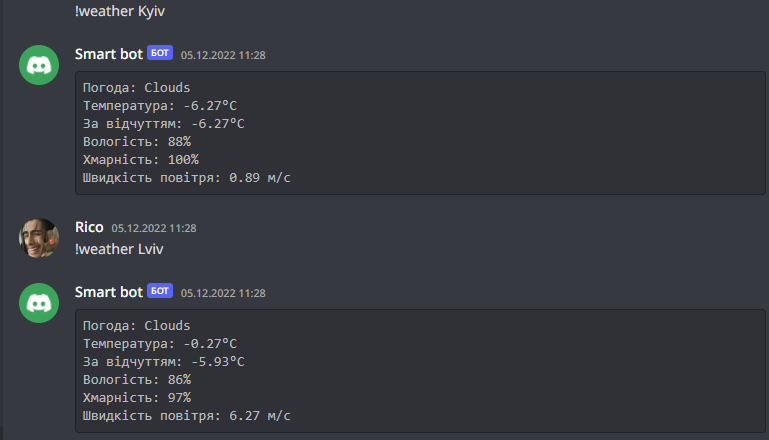

# Discord bot
Бот Smart, який вміє видавати ролі, відтворювати музику та видавати інформацію про погоду.

## Головне про бота
Бот розділений на виклик через події (при додаванні та видалення реакцій) та команди, які викликаються за допомогою префікса "!":
- help
- ping
- join
- leave
- play "url"
- pause
- resume
- weather "city"
- sd
  
В коді вони позначені, як _@bot.event_ та _@bot.command()_.

## Виклик через подію додавання та видалення реакції
Коли на контретне повідомлення (Config.Post_ID) додається контретна реакція (емодзі), користувачу видається роль. Бот вміє видавати такі ролі за такими емодзі:
- 👦 - Учень
- 🎓 - Студент
- 💼 - Працівник

Якщо користувач видалить свою реакцію - роль видаляється.
```
@bot.event 
async def on_raw_reaction_add(payload):
    if payload.message_id == Config.Post_ID:
        guild_id = payload.guild_id
        guild = discord.utils.find(lambda g: g.id == guild_id, bot.guilds)
        role = Config.Roles(payload, guild).Role()
        if role is not None:
            member = discord.utils.find(lambda m: m.id == payload.user_id, guild.members)
            if member is not None:
                await payload.member.add_roles(role)
                print("Додано роль {0} для {1}.".format(role, member))
            else:
                print("Користувача не знайдено.")
        else:
            print("Роль не знайдено.")


@bot.event  
async def on_raw_reaction_remove(payload):
    if payload.message_id == Config.Post_ID:
        guild_id = payload.guild_id
        guild = discord.utils.find(lambda g: g.id == guild_id, bot.guilds)
        role = Config.Roles(payload, guild).Role()
        if role is not None:
            member = discord.utils.find(lambda m: m.id == payload.user_id, guild.members)
            if member is not None:
                await member.remove_roles(role)
                print("Віднято роль {0} у {1}.".format(role, member))
            else:
                print("Користувача не найдено.")
        else:
            print("Роль не знайдено.")
```
## Команда help
Відображає список команд користувачу (Config.help). За замовчуванням, команда прописана в бота зі своим списком, тому на початку його відключаємо для створення свого списку. 
```
bot.remove_command('help')


@bot.command()  
async def help(ctx):
    await ctx.send(Config.help)
```


## Команда ping
Відображає швидкість оклику бота на команди (у мене, наприклад, швидкість отклику 138 мс).
```
@bot.command()  
async def ping(ctx):
    await ctx.send(f"Pong *{round(bot.latency * 1000)} Ms*")
```


## Команди join та leave
> _Виконується тільки тоді, коли користувач знаходиться в голосовому каналі._ 

Бот підключається (join) та відключається (leave) до голосового каналу.
```
@bot.command()
async def join(ctx):
    channel = ctx.message.author.voice.channel
    await channel.connect()


@bot.command() 
async def leave(ctx):
    ctx.voice_client.stop()
    await ctx.voice_client.disconnect()
```
## Команди play "url", pause та resume
> _Бот повинен бути в голосовому каналі._
> _"url" посилання має бути до сайту [Youtube](https://www.youtube.com)._

Відтворює посилання в голосовому каналі. Якщо це посиланне виконується вперше, бот повинен завантажити відео та сконвертувати на "найкраще аудіо". Під час відтворення, бота можна призупинити та відновити роботу.
```
@bot.command() 
async def play(ctx, *, url):
    ctx.voice_client.stop()
    async with ctx.typing():
        player = await Music.YTDLSource.from_url(url, loop=bot.loop)
        ctx.voice_client.play(player, after=lambda e: print(f'Player error: {e}') if e else None)
    await ctx.send(f'Now playing: {player.title}')


@bot.command()  
async def pause(ctx):
    ctx.voice_client.pause()


@bot.command() 
async def resume(ctx):
    ctx.voice_client.resume()

```
>_Ось так виглядає консоль програміста під час виконання мого запиту:_
> 

## Команди weather "city"
>_"сity" місто повинен бути написаним на англійскій мові._

За вказаним містом бот виводить інформацію про погоду. В коді бот встановлює зв'язок зі [сайтом](https://openweathermap.org) та отримує данні, які потрібно редагувати для читабельності користувачу.
```
@bot.command() 
async def weather(ctx, *, City: str):
    def kelvin_to_celsius(kelvin):
        celsius = kelvin - 273.15
        return celsius

    url = Config.weather_url + "appid=" + Config.API_key + "&q=" + City
    response = requests.get(url).json()
    weather = response['weather'][0]['main']
    temp_kelvin = response['main']['temp']
    temp_celsius = kelvin_to_celsius(temp_kelvin)
    feels_like_kelvin = response['main']['feels_like']
    feels_like_celsius = kelvin_to_celsius(feels_like_kelvin)
    wind_speed = response['wind']['speed']
    humidity = response['main']['humidity']
    cloud = response['clouds']['all']
    await ctx.send(f"""
        ```
Погода: {weather}
Температура: {temp_celsius:.2f}°C
За відчуттям: {feels_like_celsius:.2f}°C
Вологість: {humidity}%
Хмарність: {cloud}%
Швидкість повітря: {wind_speed} м/c ``` """)
```


## Команда sd
Вимикає бота (а чому б і ні). Після введення, бот інформує користувача, що він вимикається.
```
@bot.command()
async def sd(ctx):
    await ctx.send("Виконується викнення бота")
    await bot.logout()
```
